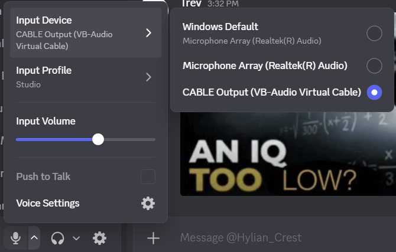

# DiscordStackAudio
So imagine you had a stack of plates, every sentence you say gets put onto the stack of plates, but the program constantly is removing from the stack of plates.
# INSPIRED BY DOUG DOUG
https://www.youtube.com/watch?v=bSnkR00N1HM

# REQUIREMENTS:
So you need VB Virtual Audio Cable for this:
https://vb-audio.com/Cable/

Then run the program and simply start talking!

To disable the program, you just need to type anything into the console and press enter. Give the program a few seconds and it will terminate itself. You can also forcefully end task in Task Manager.

A lot of the audio handling code was stolen from StackOverflow if I'm being honest, credit to the threads are in the files themselves. This is also the first major thing I'm publishing on github! Wow! Any tips would be appreciated!